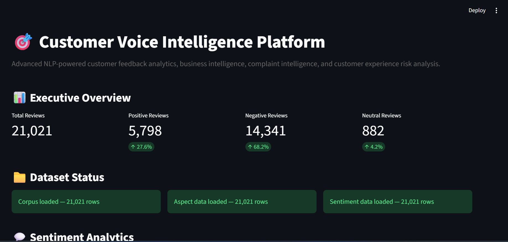

\# Customer Voice Intelligence Platform


An end-to-end NLP and customer experience intelligence platform that transforms customer reviews into actionable business insights using transformer-based sentiment analysis, business-aspect intelligence, complaint analytics, customer experience risk analysis, and an interactive Streamlit dashboard.


\---


\## Overview


Customer Voice Intelligence Platform analyzes customer reviews to understand:


\- What customers are saying

\- Whether customer sentiment is positive, negative, or neutral

\- Which business areas generate the most customer discussion

\- Which areas receive the most complaints

\- How complaints relate to customer ratings

\- How customer sentiment changes over time

\- How customer experience varies across countries

\- Which business areas require management attention

\- Where businesses have customer experience strengths and opportunities


The project combines \*\*Natural Language Processing, Machine Learning, Transformer Models, Feature Engineering, Business Intelligence, and Interactive Data Visualization\*\* into a single analytics platform.


## Dashboard Preview


\---

## Dashboard Preview




\## Key Capabilities


\### Sentiment Intelligence


The platform classifies customer reviews into:


\- Positive

\- Negative

\- Neutral


A fine-tuned DistilBERT transformer model is used for the final sentiment classification system.


\### Business Aspect Intelligence


Customer feedback is analyzed across eight business areas:


1\. Delivery

2\. Customer Service

3\. Product Quality

4\. Pricing

5\. Returns \& Refunds

6\. Website \& App

7\. Account \& Billing

8\. Availability \& Selection


\### Complaint Intelligence


The platform identifies and analyzes negative customer feedback to provide:


\- Complaint volume

\- Complaint rate

\- Complaint concentration by business area

\- Complaint rating analysis

\- Country-level complaint patterns

\- Complaint trends over time

\- Dedicated complaint review exploration


\### Customer Experience Risk Intelligence


The platform calculates an \*\*Attention Score\*\* to help organize business areas according to the combination of:


\- Negative sentiment percentage

\- Negative review volume


The Attention Score is a dashboard prioritization metric and is not a predictive probability.


\### Executive Business Intelligence


The dashboard provides:


\- Executive KPIs

\- Customer strengths

\- Complaint areas

\- Business priority areas

\- Automated business insights

\- Executive narrative

\- Exportable business intelligence datasets


\---


\# Dataset


The processed customer voice corpus contains:


\*\*21,021 unique customer reviews\*\*


\### Dataset Composition


| Component | Value |

|---|---:|

| Total Reviews | 21,021 |

| Negative Reviews | 14,341 |

| Positive Reviews | 5,798 |

| Neutral Reviews | 882 |


\### Dataset Splits


| Split | Reviews |

|---|---:|

| Training | 14,188 |

| Validation | 4,013 |

| Test | 2,820 |


The dataset was cleaned, deduplicated, normalized, and prepared before model training and downstream analytics.


\---


\# NLP Model


\## Final Model


\*\*DistilBERT\*\*


The final transformer-based sentiment model achieved:


| Metric | Score |

|---|---:|

| Accuracy | 91.63% |

| Macro F1 | 69.93% |


The project also evaluates classical machine learning baselines.


\### Model Comparison


| Model | Macro F1 |

|---|---:|

| DistilBERT | 69.93% |

| Logistic Regression | 67.21% |

| Linear SVM | 66.32% |


The transformer model was selected as the final sentiment model based on the evaluation results.


\---


\# NLP Pipeline


The project follows an end-to-end NLP workflow:


```text

Raw Customer Reviews

&#x20;       ↓

Data Cleaning

&#x20;       ↓

Deduplication

&#x20;       ↓

Text Preprocessing

&#x20;       ↓

Sentiment Label Preparation

&#x20;       ↓

Train / Validation / Test Split

&#x20;       ↓

Classical ML Baselines

&#x20;       ↓

DistilBERT Fine-Tuning

&#x20;       ↓

Model Evaluation

&#x20;       ↓

Business Aspect Detection

&#x20;       ↓

Aspect-Level Sentiment Analysis

&#x20;       ↓

Complaint Intelligence

&#x20;       ↓

Customer Experience Risk Analysis

&#x20;       ↓

Executive Business Dashboard


Business Intelligence Architecture


The platform transforms NLP predictions into business intelligence through several analytical layers.


Customer Reviews

&#x20;      │

&#x20;      ▼

Sentiment Intelligence

&#x20;      │

&#x20;      ├── Positive

&#x20;      ├── Negative

&#x20;      └── Neutral

&#x20;      │

&#x20;      ▼

Business Aspect Intelligence

&#x20;      │

&#x20;      ├── Delivery

&#x20;      ├── Customer Service

&#x20;      ├── Product Quality

&#x20;      ├── Pricing

&#x20;      ├── Returns \& Refunds

&#x20;      ├── Website \& App

&#x20;      ├── Account \& Billing

&#x20;      └── Availability \& Selection

&#x20;      │

&#x20;      ▼

Complaint Intelligence

&#x20;      │

&#x20;      ▼

Customer Experience Risk

&#x20;      │

&#x20;      ▼

Executive Business Insights

&#x20;      │

&#x20;      ▼

Interactive Streamlit Dashboard

Dashboard


The Streamlit dashboard provides multiple analytical sections.


Executive Overview


Provides high-level customer voice KPIs including:


Total reviews

Positive reviews

Negative reviews

Neutral reviews

Overall sentiment distribution

Sentiment Analytics


Visualizes:


Sentiment distribution

Sentiment percentages

Positive / negative / neutral volume

Business Aspect Intelligence


Analyzes:


Aspect frequency

Aspect coverage

Aspect-level sentiment

Positive and negative aspect performance

Rating Intelligence


Analyzes:


Average rating

Median rating

Rating distribution

Average rating by sentiment

Rating statistics

Time \& Trend Intelligence


Analyzes:


Monthly review volume

Monthly sentiment trends

Monthly average rating

Yearly customer voice summaries

Geographic Intelligence


Analyzes:


Review volume by country

Sentiment by country

Complaint patterns by country

Country-level customer experience indicators

Customer Review Explorer


Provides interactive filtering by:


Keyword

Sentiment

Rating

Country

Date

Business aspect


Users can inspect individual customer reviews directly from the dashboard.


Complaint Intelligence


Provides:


Complaint KPIs

Complaint volume by aspect

Complaint concentration

Complaint vs rating analysis

Country complaint patterns

Complaint trends

Dedicated complaint explorer

Customer Experience Risk \& Opportunity Intelligence


Provides:


Business Aspect Attention Matrix

Attention Score

Positive vs negative sentiment analysis

Review volume vs attention analysis

Customer experience indicators

Executive interpretation

Executive Business Summary


Provides:


Executive health indicators

Executive snapshot

Customer strengths

Top complaint areas

Business priority areas

Executive narrative

CSV export center

Project Structure

Customer-Voice-Intelligence/

│

├── app/

│   ├── dashboard.py

│   └── data\_loader.py

│

├── data/

│   ├── raw/

│   ├── interim/

│   └── processed/

│

├── notebooks/

│

├── src/

│   ├── data/

│   ├── features/

│   ├── models/

│   ├── evaluation/

│   └── utils/

│

├── artifacts/

├── reports/

├── tests/

├── configs/

│

├── .gitignore

├── README.md

└── requirements.txt

Technology Stack

Programming

Python

Pandas

NumPy

Machine Learning

Scikit-learn

Logistic Regression

Linear SVM

NLP

Hugging Face Transformers

DistilBERT

Tokenization

Transformer-based text classification

Data Analysis

Exploratory Data Analysis

Data Cleaning

Feature Engineering

Sentiment Analysis

Aspect Analysis

Rating Analysis

Time-Series Analysis

Visualization

Plotly

Streamlit

Deployment / Application

Streamlit

Development

Jupyter Notebook

VS Code

Git

Installation


Clone the repository and create a virtual environment.


git clone <YOUR\_GITHUB\_REPOSITORY\_URL>


cd Customer-Voice-Intelligence


python -m venv .venv


Activate the environment on Windows:


.venv\\Scripts\\Activate.ps1


Install dependencies:


pip install -r requirements.txt

Running the Dashboard


From the project root:


streamlit run app\\dashboard.py


The dashboard will open in your browser.


Data Requirements


The dashboard expects the following processed datasets:


data/processed/customer\_voice\_corpus.csv

data/processed/customer\_voice\_aspects.csv

data/processed/aspect\_level\_sentiment.csv


These files contain the processed customer review and business intelligence data required by the dashboard.


Large datasets and trained model artifacts are intentionally excluded from the Git repository through .gitignore.


Example Business Questions


The platform can help answer questions such as:


Customer Experience

What percentage of customers are negative?

Which areas receive the most customer attention?

Which business areas generate the most positive feedback?

Complaints

Which business area receives the most complaints?

What ratings are associated with negative customer experiences?

How do complaint rates vary across countries?

Are complaints increasing or decreasing over time?

Business Prioritization

Which areas require additional attention?

Which areas represent customer experience strengths?

Which areas combine high complaint volume with high negative sentiment?

Executive Reporting

What is the overall customer experience picture?

What are the major customer pain points?

What are the strongest customer experience areas?

Which areas should management investigate further?

Model Evaluation


The project evaluates both classical machine learning and transformer-based approaches.


The classical models provide baseline performance, while the fine-tuned DistilBERT model provides the final transformer-based sentiment classification system.


Evaluation focuses on:


Accuracy

Macro F1

Class-level performance

Model comparison


Macro F1 is particularly important because the neutral sentiment class is substantially smaller than the positive and negative classes.


Engineering Highlights


This project demonstrates practical experience in:


End-to-end NLP pipeline development

Transformer fine-tuning

Classical ML benchmarking

Imbalanced classification analysis

Business taxonomy design

Aspect-level sentiment analysis

Customer complaint analytics

Feature engineering

Interactive analytics

Streamlit application development

Data validation

Dashboard architecture

Business-oriented model interpretation

Exportable analytical outputs

Limitations


The sentiment labels and business-aspect signals are based on the available review data and the project's labeling methodology.


The Attention Score is designed as a business prioritization metric for dashboard analysis. It should not be interpreted as a probability of future customer churn, complaint escalation, or business loss.


Model performance should also be evaluated against domain-specific labeled data before being used in a production decision-making system.


Future Improvements


Potential future extensions include:


More advanced aspect extraction

Context-aware aspect sentiment

Explainable NLP predictions

Real-time review ingestion

Automated review monitoring

API-based inference

RAG-powered customer insight generation

LLM-generated executive reports

Automated customer feedback alerts

Production deployment

Model monitoring and evaluation pipelines

Author


Muzamil Rasul


Data Scientist | ML Engineer | NLP \& AI Solutions


Project Focus


Natural Language Processing • Machine Learning • Customer Experience Intelligence • Business Analytics • AI Applications

